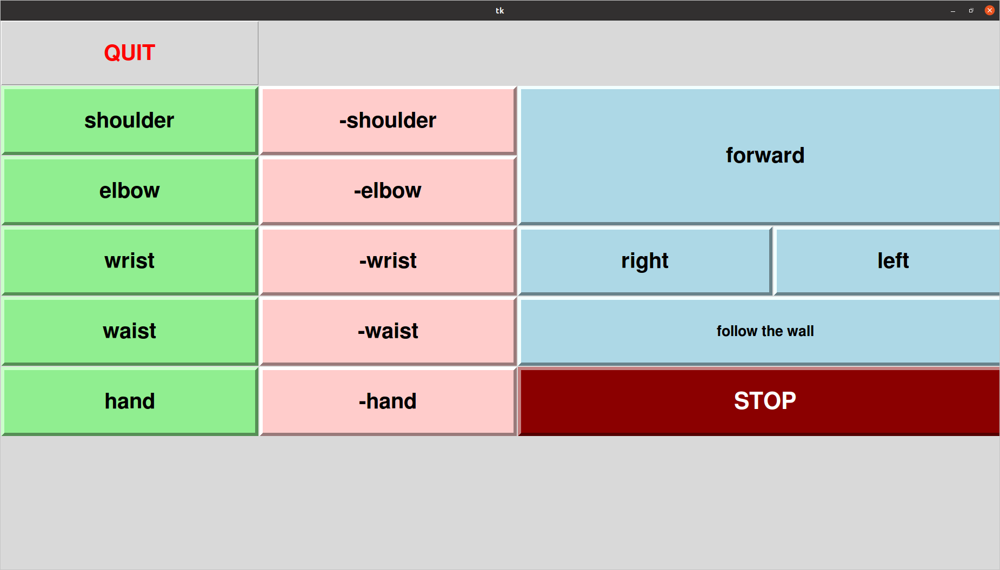

# Kontrolovanie robota jupiter cez obrazovku

## o kode 
Program je napisane v python jazyku a je tam naprogramovana komunikacia medzi modulmi vramci systemu ros.
V kode je naprogramovany pohyb robotickeho ramena a pohyb robota. Je pritom pouzity senzor lidar a je ovladetelny dotikovou obrazovkou.

## Ako naistalovat package
presunte patrik_shovcase subor do catkin_ws/src priecinka
## Ako spustit robota
zapnite napajenie.

spustite pocitac


## Ako spustit program


zapnite napajanie do robotickej ruky (Varovanie: ruka sa vystrie do vzpriamenej polohy ako je naobrazku dajte pozor aby netrafila display)


a odistite cerveny gombik ktore posunie napajanie do motorov.
otvorte terminal aj spustite tento kod.
```
roslaunch patrik_showcase demo.launch
```
## viac o programe
program je interaktivne menu vdaka ktoremu je mozne porgramovat robota.
pri spusteni



This folder contains application for demonstration of Jupiter capabilities.

(c) Patrik Homola, FMFI UK, 2022

Links

http://learn.turtlebot.com/

